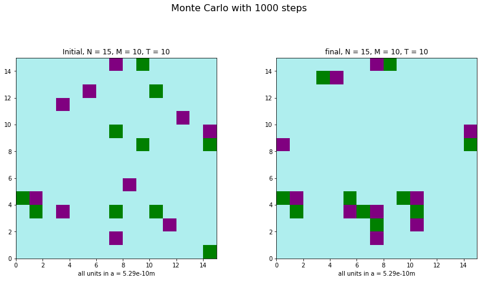
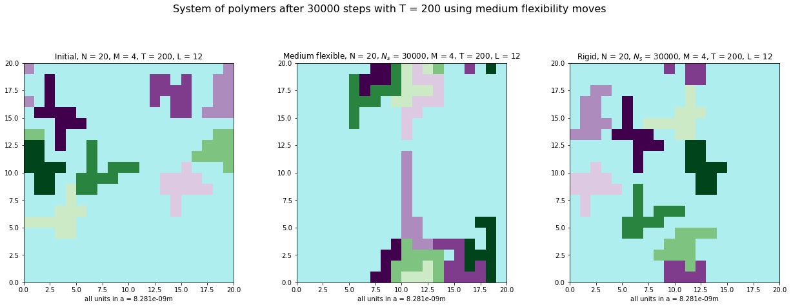

# Scientific Computation in Biophysics

## Overview

This repository contains a computational biophysics project (TMA4320) that utilizes Monte Carlo simulations to study the formation of membrane-less organelles. The project implements numerical methods to model systems of charged monomers and polymers, investigating how these structures evolve over time under various physical conditions.

## Project Structure

The code is organized into modular Python files for better maintainability:

- **`core_functions.py`** - Fundamental functions used across simulations (neighbors, energy scales, utilities)
- **`monomer_simulation.py`** - Monomer-specific functions (system creation, energy calculation, Monte Carlo)
- **`polymer_simulation.py`** - Polymer-specific functions (system creation, rigid/flexible moves, Monte Carlo)
- **`analysis_tools.py`** - Clustering analysis and statistical measurements
- **`visualization.py`** - Plotting and visualization functions
- **`TMA4320 biophysics.ipynb`** - Main Jupyter notebook with examples and analysis

## Quick Start

### Prerequisites
- Python 3.7+
- NumPy
- Matplotlib
- SciPy
- Numba (for JIT compilation and performance)

### Installation
```bash
pip install numpy matplotlib scipy numba
```

### Basic Usage

```python
# Import all modules
from core_functions import *
from monomer_simulation import *
from visualization import *

# Create a monomer system
N, M = 15, 10  # 15x15 grid, 20 monomers total
grid, locations = createSystemOfMonomers(N, M)

# Run Monte Carlo simulation
N_s, T = 1000, 300  # 1000 steps, 300K temperature
final_grid, energy, initial_grid, moves = MC(N_s, N, M, T)

# Visualize results
info = [["Initial", "Final"], [0, N_s], [M, M], [T, T], [0, 0], [False, False], [False, False]]
plotSystems([initial_grid, final_grid], info, "Monte Carlo Evolution")
```

### Running the Full Analysis
Open `TMA4320 biophysics.ipynb` in Jupyter Notebook to explore the complete analysis with detailed explanations and visualizations.

## Scientific Background

### System Description

The project models a simplified 2-dimensional cellular environment using a discrete grid system. This approach quantifies positions and interactions between monomers while maintaining computational efficiency. The system operates under several key assumptions:

- **Discrete Grid System**: Positions are quantified on a 2D grid representing a plane cross-section of a cell
- **Nearest-Neighbor Interactions**: Only neighboring monomers (distance = unit step length) interact with each other
- **Periodic Boundary Conditions**: The grid behaves as a geometric torus to simulate realistic "outside" boundary effects
- **Electrostatic Interactions**: Energy calculations follow superposition of electric potential principles

### Physical Parameters

The system uses two different scales depending on the type of simulation:

**Monomer System:**

- Unit step length: a = (23 × 10⁻⁶)² m
- Relative permittivity: εᵣ = 78

**Polymer System:**

- Unit step length: a = (91 × 10⁻⁶)² m
- Relative permittivity: εᵣ = 78

## Mathematical Framework

### Energy Model

The total system energy is calculated using electrostatic potential theory:

```
E = Σᵢⱼ Vᵢⱼ
```

where the interaction potential between particles i and j is:

```
Vᵢⱼ = (1/4πε) × (qᵢqⱼ/|rᵢ - rⱼ|)
```

For quantized charges (qᵢ = wᵢe, where wᵢ ∈ Z), this simplifies to:

```
Vᵢⱼ = wᵢwⱼα    (for nearest neighbors)
Vᵢⱼ = 0         (otherwise)
```

where α = e²/(4πε₀εᵣa) is the fundamental energy scale.

### Monte Carlo Algorithm

The simulation employs the Metropolis algorithm with the following acceptance criteria:

1. **Energy Decrease**: Moves that lower system energy are always accepted
2. **Thermal Fluctuations**: Moves that increase energy are accepted with probability:
   ```
   P(accept) = exp(-ΔE/kᴃT)
   ```

This approach ensures convergence toward equilibrium while allowing thermal fluctuations.

## Key Features

### Monomer Simulations

- Generation of random monomer configurations with charges ±1
- Implementation of single-particle Monte Carlo moves
- Energy minimization through electrostatic interactions
- Temperature-dependent clustering behavior analysis

### Polymer Simulations

- Construction of connected polymer chains with length L
- **Rigid Movement**: Entire polymer moves as a single unit
- **Flexible Movement**: Individual segments can move independently while maintaining connectivity
- Cluster formation analysis for different polymer lengths

### Advanced Analysis

- Cluster size distribution calculations
- Temperature dependence of aggregation behavior
- Statistical analysis using mean-of-means estimators
- Equilibration time modeling

## Computational Optimizations

### Numba JIT Compilation

The project extensively uses Numba's Just-In-Time (JIT) compilation to achieve significant performance improvements:

```python
@jit(nopython=True)
def function_name():
    # Optimized function code
```

This optimization enables:

- Execution of millions of Monte Carlo steps
- Large-scale statistical sampling
- Real-time visualization of system evolution

### Performance Considerations

- Efficient neighbor-finding algorithms with periodic boundaries
- Optimized energy calculation routines
- Memory-efficient grid operations
- Parallel-ready algorithm design

## Physical Insights

### Temperature Effects

- **Low Temperature**: Formation of large, stable clusters resembling checkerboard patterns
- **High Temperature**: Increased thermal fluctuations leading to smaller, more dispersed clusters
- **Equilibration Time**: Exponential relationship between temperature and time to reach equilibrium

### Polymer Behavior

- **Rigid vs Flexible**: Flexible polymers achieve lower energy states through shape adaptation
- **Length Dependence**: Relationship between polymer length L and cluster characteristics
- **Contact Optimization**: Polymers with opposite charges maximize contact surfaces

### Scaling Laws

The analysis reveals important scaling relationships:

- Mean cluster size ⟨d⟩ inversely proportional to number of clusters ⟨m⟩
- Product ⟨d⟩⟨m⟩/L = 2M (conservation relationship)
- Temperature-dependent cluster size distributions

## Statistical Methods

### Estimator Selection

The project employs sophisticated statistical methods:

**Mean-of-Means Estimator**:

```
μ̃ = (1/n) Σᵢ₌₁ⁿ (1/mᵢ) Σⱼ₌₁ᵐⁱ xⱼ
```

This approach provides:

- Unbiased estimation of expected values
- Reduced variance compared to simple averaging
- Better precision for cluster size measurements

### Sample Size Determination

Using statistical confidence interval theory:

```
SS = Z²p(1-p)/M²
```

where Z = 1.96 (95% confidence), M = 0.05 (margin of error), leading to n = 385 samples.

## Applications

This computational framework provides insights into:

- **Biological Phase Separation**: Understanding how membrane-less organelles form in cells
- **Self-Assembly Processes**: Mechanisms of spontaneous structure formation
- **Temperature-Dependent Behavior**: How thermal energy affects biological organization
- **Polymer Physics**: Fundamental principles of chain molecule behavior

## Simulation Results

### Monomer System Evolution

The simulation begins with randomly distributed charged monomers on a 2D grid. Through Monte Carlo dynamics, the system evolves toward lower energy configurations where oppositely charged monomers cluster together.


*Initial random distribution of charged monomers. Green squares represent positive charges (+1), purple squares represent negative charges (-1), and pale turquoise represents solvent.*


*System evolution after 1000 Monte Carlo steps, showing beginning of cluster formation.*

### Single Monomer Movement

The algorithm allows individual monomers to move to neighboring positions if energetically favorable or through thermal fluctuations.


*Demonstration of single monomer movement. Left shows initial position, right shows position after one step to the right.*

### Temperature Effects on Clustering

Temperature plays a crucial role in determining the final system configuration. Lower temperatures favor large, stable clusters, while higher temperatures lead to more dispersed configurations due to increased thermal fluctuations.


*System after 50,000 steps at T = 200K showing large, stable clusters resembling checkerboard patterns.*


*System after 50,000 steps at T = 500K showing smaller, more dispersed clusters due to thermal fluctuations.*


*Energy evolution comparison between T = 200K (red) and T = 500K (blue). Lower temperature achieves lower energy but requires more steps to equilibrate.*

### Cluster Analysis

The simulation includes sophisticated cluster analysis to quantify aggregation behavior.


*Cluster analysis for low temperature system. Different colors represent distinct clusters.*


*Cluster analysis for high temperature system showing more numerous, smaller clusters.*

### Energy Evolution

Energy monitoring reveals the system's approach to equilibrium and the effect of thermal fluctuations.


*Typical energy evolution showing initial rapid decrease toward equilibrium followed by thermal fluctuations around the mean.*

### Polymer Systems

The project extends to study connected polymer chains that move as coherent units while maintaining internal structure.


*Initial polymer system with L = 21 monomers per polymer. Different colored chains represent polymers with different charges.*


*Demonstration of rigid polymer movement. The entire lime green polymer moves one unit to the right as a coherent structure.*

### Rigid vs Flexible Polymer Dynamics

Two movement mechanisms are implemented: rigid (entire polymer moves together) and flexible (individual segments can move while maintaining connectivity).


*Flexible polymer movement allowing shape adaptation while maintaining chain connectivity.*


*Polymer system evolution after 30,000 Monte Carlo steps at T = 200K showing cluster formation between oppositely charged polymers.*

### Movement Type Comparison

Different movement algorithms show distinct clustering behaviors and energy landscapes.


*Comparison between rigid and flexible polymer movement systems. Flexible systems achieve lower energy through better shape adaptation.*

## Scientific Significance

The project demonstrates key biophysical principles:
- Electrostatic interactions drive spontaneous organization
- Temperature serves as a control parameter for structure formation
- Flexibility enhances system adaptability and energy minimization
- Statistical mechanics governs macroscopic behavior from microscopic interactions

### Key Insights

**Scaling Laws:**
- Mean cluster size ⟨d⟩ inversely proportional to number of clusters ⟨m⟩
- Product ⟨d⟩⟨m⟩/L = 2M (conservation relationship)
- Temperature-dependent cluster size distributions

**Physical Principles:**
1. **Electrostatic Clustering**: Opposite charges naturally aggregate to minimize energy
2. **Thermal Activation**: Higher temperatures enable escape from local energy minima
3. **Geometric Constraints**: Polymer connectivity constrains available configurations
4. **Flexibility Advantage**: Shape adaptation allows better optimization of contact surfaces

**Biological Relevance:**
- **Membrane-less Organelle Formation**: Spontaneous phase separation in cellular environments
- **Protein Aggregation**: How charged residues influence protein clustering
- **Temperature Sensitivity**: How thermal fluctuations affect biological organization
- **Polymer Physics**: Fundamental principles governing biomolecular chain behavior

This work contributes to understanding fundamental processes in cell biology, particularly the formation and behavior of membrane-less organelles such as stress granules, P-bodies, and nucleoli.
